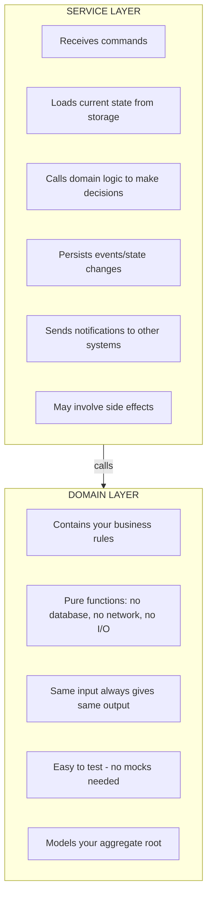

# Getting started

## What problem does Edomata solve?

Traditional applications store data by overwriting the current state. When you update a user's balance, you replace the old value with the new one. This approach has limitations:

- **Lost history**: You can't see how the balance changed over time
- **Debugging difficulty**: When something goes wrong, you can't trace what happened
- **Audit challenges**: Compliance often requires knowing the full history of changes
- **Concurrent conflicts**: Two updates at the same time can cause data loss

**Event-driven systems** solve these problems by storing *what happened* (events) rather than just the current state. Edomata helps you build these systems in a clean, composable way using Scala.

> **Real-world analogy**: Think of a bank ledger vs. a bank balance. The balance tells you "you have $500", but the ledger tells you "you deposited $1000, withdrew $300, deposited $100, withdrew $300" - from which you can always calculate the balance, plus understand how you got there.

## Add to your build

```scala
libraryDependencies += "dev.hnaderi" %% "edomata-core" % "@VERSION@"
```

or for scala.js
```scala
libraryDependencies += "dev.hnaderi" %%% "edomata-core" % "@VERSION@"
```

## Layers of abstraction

Before jumping in to code, we should know the big picture of what we are going to do;

### Layers

Application logic is divided into 2 separate layers:



> **What is a "pure function"?** A function with no side effects - it doesn't read from databases, send emails, or do anything that affects the outside world. Like a math formula: `f(x) = x + 1` always returns the same result for the same input.

> **What is a "side effect"?** Any action that affects something outside your function: writing to a database, sending an HTTP request, printing to console, getting the current time. Side effects make code harder to test and reason about.

**Domain layer**:
* Is pure and has no side effects at all
* Ensures aggregate invariants and implements all business rules and logic
* Does not change frequently in well established businesses
* Models an aggregate root in DDD
* Aggregate roots just hold enough data to decide based on business rules and maintain invariants; they don't care about any other data

**Service layer**:
* May involve side effects
* Is very minimal and mostly gluing
* Must be idempotent (safe to run multiple times with same result)
* Models application services and command handlers in DDD

> **What is "idempotent"?** An operation that produces the same result whether you run it once or multiple times. Like pressing an elevator button - pressing it 5 times has the same effect as pressing it once. This is important because in distributed systems, operations might be retried automatically.

### Aggregate space

> **What is an "Aggregate"?** In domain-driven design (DDD), an aggregate is a cluster of related objects that we treat as a single unit for data changes. Think of a shopping cart: the cart and its items form an aggregate. You don't update items independently - you always go through the cart to ensure consistency (e.g., total price is correct).

> **What is an "Aggregate Root"?** The main entity that controls access to the aggregate. For a shopping cart aggregate, the Cart is the root. All changes go through it.

* Each aggregate has a unique address (like an ID)
* All the possible aggregates together form our aggregate space which is an infinite space (mathematically speaking)
* There is nothing as a non existing aggregate - aggregates that are not created yet do exist in their initial state

> **Real-world analogy**: Think of it like phone numbers. The phone number 555-0199 "exists" even if no one has claimed it yet - it just hasn't been assigned. Similarly, aggregate "order-12345" exists in its initial (empty) state even before any events happen to it.

### Variants: Choosing the right automaton

Currently these kinds of state machines are implemented in Edomata:

| Type | Name | Use When |
|------|------|----------|
| `Edomaton` | Event-driven automaton | You need full event sourcing - storing all events and rebuilding state from them |
| `Stomaton` | State-driven automaton | You only need current state, but want clean command handling (CQRS style) |

> **What is Event Sourcing?** A persistence pattern where you store every change as an event, then rebuild current state by replaying all events. Like a git history - you can see every commit and rebuild any past state.

> **What is CQRS?** Command Query Responsibility Segregation - separating the code that changes data (commands) from the code that reads data (queries). This allows you to optimize each path independently.

**Choose `Edomaton` when:**
- You need audit trails or compliance records
- You want to be able to "replay" history
- Your domain naturally thinks in terms of "what happened"
- You need to build multiple views from the same events

**Choose `Stomaton` when:**
- You only care about current state
- Event history isn't valuable for your use case
- You want simpler persistence (just save the state)
- You still want clean separation of commands and business logic


## Next
That's all we need to know for now; talk is enough, let's jump into code!

For event sourced applications, [follow this link](1-1_eventsourcing.md),
For CQRS applications (without event sourcing), [follow this link](1-2_cqrs.md)
