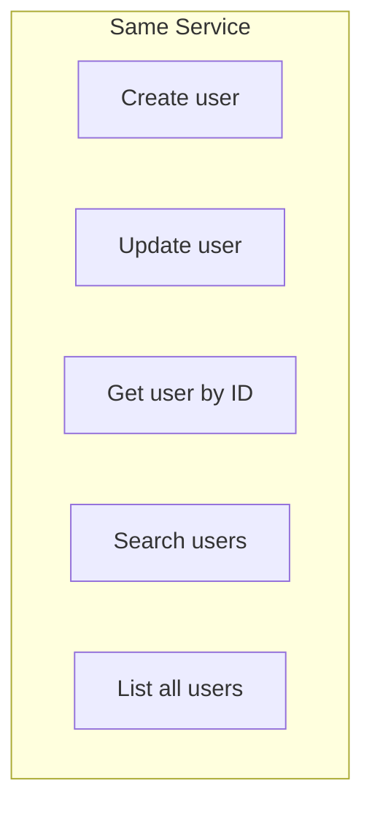
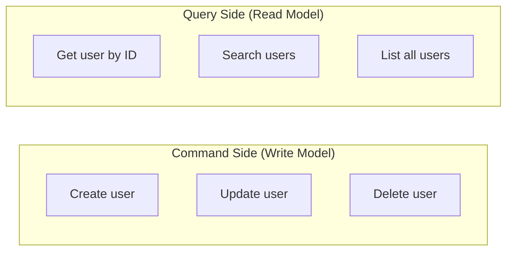
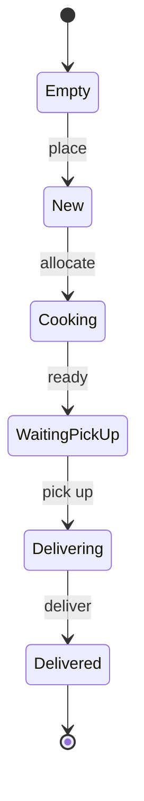

# CQRS style

## What is CQRS?

CQRS stands for **Command Query Responsibility Segregation**. It's a pattern that separates reading data (queries) from writing data (commands).

> **Real-world analogy**: Think of a library. The card catalog (or computer search) is optimized for finding books (queries). The checkout desk is optimized for borrowing and returning books (commands). They serve different purposes and could even be in different locations.

**Traditional approach**:


**CQRS approach**:


**When to use CQRS (without event sourcing)?**
- Your read and write patterns are very different
- You want to scale reads and writes independently
- Your business logic is complex enough to warrant separation
- You don't need the full audit trail of event sourcing

> **CQRS vs Event Sourcing**: You can have CQRS without event sourcing! This tutorial shows how to use Edomata's `Stomaton` for clean command handling while storing only the current state (not the event history).

## Imports

```scala mdoc
import edomata.core.*
import edomata.syntax.all.* // for convenient extension methods
import cats.implicits.* // to make life easier
```

## Domain layer

### EitherNec

> **Why `EitherNec` instead of `Decision`?**
> - `Decision`: Used when you need to accumulate events (event sourcing)
> - `EitherNec`: Used when you just need success/failure (CQRS without events)
>
> Since we're not storing events, we don't need `Decision`'s event accumulation feature.

If you are not familiar with `EitherNec` from cats, it is basically a type alias like the following
```scala
type EitherNec[L, R] = Either[NonEmptyChain[L], R]
```

which obviously shows that it behaves exactly like `Either`;

> **What is `Either`?** A type that represents one of two possibilities:
> - `Right(value)` - success with a value
> - `Left(error)` - failure with an error
>
> By convention, `Right` is the "right" (correct) result.

> **What is `NonEmptyChain`?** A list that's guaranteed to have at least one element. Perfect for errors - if something failed, there's at least one reason why.

Examples:

```scala mdoc:to-string
val e1 = Right(1)
val e2 = "Missile Launched!".asRight
val e3 = "No remained missiles to launch!".leftNec
```

> **Reading the syntax**:
> - `Right(1)` - success with value `1`
> - `"...".asRight` - same as `Right("...")`
> - `"...".leftNec` - failure with a NonEmptyChain containing that message

Either is composable
```scala mdoc:to-string
val e4 = e1.map(_ * 2)
val e5 = e2 >> e1
```

You can also use for-comprehension:

```scala mdoc:to-string
val e6 = for {
  a <- e4
  b <- e5
} yield a + b

```

> **For-comprehension with Either**: Each step must succeed. If any step returns `Left`, the whole chain stops and returns that `Left`.

For more [examples see here](https://typelevel.org/cats/datatypes/either.html) and also [here](https://typelevel.org/cats/datatypes/validated.html)

### Modeling

Let's use what we've learned so far to create an overly simplified model of a food delivery system.
Assume we have the following business requirements:

- User must be able to place order
- Line cook gets notified of new orders
- Line cook allocates food to a cook
- User gets notified of order status
- Kitchen can report that food is ready
- Delivery gets notified of ready foods
- Delivery allocates food to a delivery unit
- Delivery can mark an order as delivered
- User can submit a rating of her experience

Let's visualize the order lifecycle:



> **Scala syntax: enum** We'll use scala 3 enums for modeling ADTs, as they are neat and closer to what modeling is all about; but you can use `sealed trait`s and normal `case class`es too

Let's start with aggregate root which is the order here:

```scala
enum Order {
  case Empty
  case Placed(food: String, address: String, status: OrderStatus = OrderStatus.New)
  case Delivered(rating: Int)
}
```

> **Why these three top-level states?**
> - `Empty`: No order placed yet (initial state)
> - `Placed`: Order is in progress (with a sub-status for the current step)
> - `Delivered`: Order completed (just tracking the rating)

and order status (the sub-states while an order is in progress)

```scala mdoc
enum OrderStatus {
  case New
  case Cooking(cook: String)
  case WaitingToPickUp
  case Delivering(unit: String)
}
```

We'll continue with modeling rejection scenarios that also came from event storming:

```scala mdoc
enum Rejection {
  case ExistingOrder
  case NoSuchOrder
  case InvalidRequest // this should be more fine grained in real world applications
}
```

> **Tip**: In real applications, make rejections more specific! Instead of `InvalidRequest`, have `OrderAlreadyCooking`, `CannotDeliverUnreadyFood`, etc. This makes debugging much easier.


Now we can use `EitherNec` to write our domain logic:

```scala mdoc
import edomata.core.*
import cats.implicits.*
import cats.data.ValidatedNec

enum Order {
  case Empty
  case Placed(food: String, address: String, status: OrderStatus = OrderStatus.New)
  case Delivered(rating: Int)

  def place(food: String, address: String) = this match {
    case Empty => Placed(food, address).asRight
    case _ => Rejection.ExistingOrder.leftNec
  }

  def markAsCooking(cook: String) = this match {
    case st@Placed(_, _, OrderStatus.New) => st.copy(status = OrderStatus.Cooking(cook)).asRight
    case _ => Rejection.InvalidRequest.leftNec
  }

  // other logics from business
}
```

> **Comparing with the event sourcing example**:
>
> **Event Sourcing (Decision)**:
> ```scala
> def open: Decision[Rejection, Event, Open] = ...
> // Returns: Events to store + new state
> ```
>
> **CQRS (EitherNec)**:
> ```scala
> def place(food: String, address: String) = ...
> // Returns: Just the new state (no events)
> ```
>
> The key difference: CQRS domain logic returns the new state directly. Event sourcing returns events that are then folded to produce the new state.

### DomainModel

In order to complete modeling we must also define our aggregate's initial state;
you can assume that it's like `None` in `Option[T]`, explicitly defining an initial state has the following advantages:
- Model consistency; you are always working with your domain model, not with `Option[YourModel]`
- It enables to add new default values in the future, where your model evolves, and reduces the number of times when an upcasting or migration is required.

```scala mdoc
object Order extends CQRSModel[Order, Rejection] {
  def initial = Empty
}
```

> **`CQRSModel` vs `DomainModel`**:
> - `DomainModel` (event sourcing): Requires `initial` state AND `transition` function (to fold events)
> - `CQRSModel` (CQRS): Requires only `initial` state (no events to fold)

### Testing domain model

As everything is pure and all the logic is implemented as programs that are values, you can easily test everything:
```scala mdoc:to-string
Order.Empty.place("kebab", "home")
Order.Placed("pizza", "office").markAsCooking("chef")
```

> **Testing tip**: Since there's no database or external dependencies, you can test edge cases easily:
> ```scala
> // Test: Can't place order twice
> Order.Placed("pizza", "office").place("burger", "home")
> // Returns: Left(NonEmptyChain(ExistingOrder))
> ```

## Service layer

Domain models are pure state machines, in isolation, in order to create a complete service you need a way to:

- store and load models
- interact with them
- possibly perform some side effects

You can do all that without Edomata, as everything in Edomata is just pure data and you can use it however you like; but here we'll focus on what Edomata has to offer.

Edomata is designed around the idea of event-driven state machines,
and it's not surprising that the tools that it provides for building services are also event-driven state machines!
These state machines are like [actors](../principles/index.md#actor-model) that respond to incoming messages which are domain commands,
may possibly change state through emitting some events as we've seen in domain modeling above,
and possibly emit some other type of events for communication and integration with other services;
while doing so, they can also perform any side effects that are idempotent,
as these machines may be run several times in case of failure. That takes us to the next building block:

### Stomaton

A `Stomaton` is a state-driven automata that can do the following:

- read or modify the current state
- ask what is requested (e.g. command message)
- perform side effects
- decide (using EitherNec, return a value or reject with one or more rejections)
- notify (emit notifications, integration events, ...)
- output a value

`Stomaton`s are composable, so you can assemble them together, change them or treat them like normal data structures.

> **`Stomaton` vs `Edomaton` Decision Matrix**:
>
> | Feature | Edomaton | Stomaton |
> |---------|----------|----------|
> | Stores events | Yes | No |
> | Stores current state | Derived from events | Yes, directly |
> | Audit trail | Complete history | Only current state |
> | Storage requirements | Grows over time | Constant per aggregate |
> | Use case | Event sourcing | CQRS without ES |
> | State update | `App.state.decide(...)` | `App.modifyS(...)` |

For creating our first `Stomaton`, we need to model 2 more ADTs; commands, and notifications.

```scala mdoc
enum Command {
  case Place(food: String, address: String)
  case MarkAsCooking(cook: String)
  case MarkAsCooked
  case MarkAsDelivering(unit: String)
  case MarkAsDelivered
  case Rate(score: Int)
}

enum Notification {
  case Received(food: String)
  case Cooking
  case Cooked
  case Delivering
  case Delivered
}
```

> **Commands are imperative**: "Place an order", "Mark as cooking"
>
> **Notifications are facts**: "Order received", "Now cooking"
>
> Notifications are sent to other systems (kitchen display, delivery app, customer notifications) after processing a command.

And we can create our first service:

```scala mdoc
object OrderService extends Order.Service[Command, Notification] {
  import cats.Monad

  def apply[F[_] : Monad]: App[F, Unit] = App.router{
    case Command.Place(food, address) => for {
      ns <- App.modifyS(_.place(food, address))
      _ <- App.publish(Notification.Received(food))
    } yield ()
    case Command.MarkAsCooking(cook: String) => for {
      ns <- App.modifyS(_.markAsCooking(cook))
      _ <- App.publish(Notification.Cooking)
    } yield ()
    case _ => ??? // other command handling logic
  }
}

```

> **Key difference from Edomaton**:
> - Edomaton: `App.state.decide(_.open)` - runs a decision that emits events
> - Stomaton: `App.modifyS(_.place(food, address))` - directly modifies state
>
> With Stomaton, there's no event journal - just the current state gets updated.

That's it! We've just written our first `Stomaton`.

### Testing a Stomaton

As said earlier, everything in Edomata is just a normal value, and you can treat them like normal data.

```scala mdoc:silent
import java.time.Instant

// as we've written our service definition in a tagless style,
// we are free to provide any type param that satisfies required type-classes
val srv = OrderService[cats.Id] // or any other effect type

val scenario1 = srv.run(
  CommandMessage(
    id = "cmd id",
    time = Instant.MIN,
    address = "aggregate id",
    payload = Command.Place("taco", "home")
  ),
  Order.Empty    // state to run command on
)
```

> **Testing scenarios**: You can easily test:
> - Happy path: `Order.Empty` + `Place` command
> - Error cases: `Order.Placed(...)` + `Place` command (should reject)
> - State transitions: Check the result state matches expectations

And you can assert on response easily

```scala mdoc:to-string
scenario1.result
scenario1.notifications
```

> **What's in the response?**
> - `result`: The new state (or rejections if failed)
> - `notifications`: Messages to be published to other systems


## What's next?

So far we've created our program definitions, in order to run them as a real application in production, we need to compile them using a backend; which I'll discuss in the [next chapter](2_backends.md)
