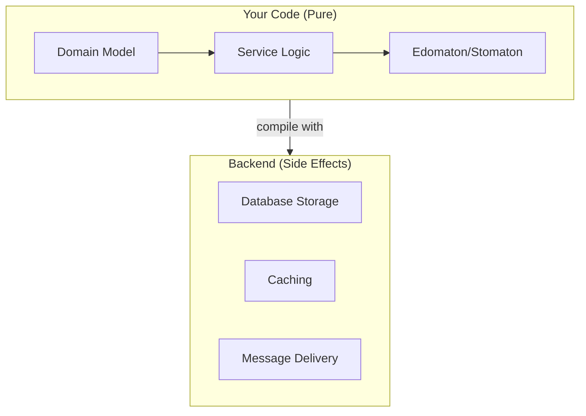
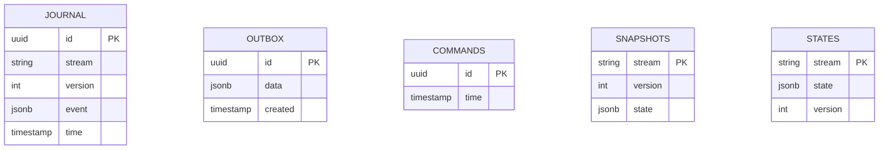

# Running

## What is a Backend?

So far, we've written pure domain logic and service definitions. But these are just *descriptions* of what should happen - like a recipe that hasn't been cooked yet. A **backend** is what actually executes your code, connecting it to databases and real-world infrastructure.

> **Real-world analogy**: Think of an architect's blueprint vs. a construction crew. The blueprint (your Edomaton/Stomaton) describes what to build. The construction crew (backend) actually builds it with real materials.



## The Program/Interpreter Pattern

A pretty common pattern in functional programming is creating programs that define a problem and then creating other programs that interpret them; and thus decoupling **what** and **how** of a program. There are a bunch of terms used for such a pattern but I'll stick with program and interpreter here.

> **Why separate "what" from "how"?**
> - **Testability**: Your pure code can be tested without databases
> - **Flexibility**: Swap backends without changing business logic
> - **Clarity**: Business rules aren't tangled with infrastructure details

An `Edomaton` is simply a definition of an action that needs to take place. It won't affect its environment even if it runs for several times (and programs that use side effects must follow this rule); it just computes the result of decision making, so we can use it.

For running such a program we need another program that can interpret this one, which in Edomata is called a backend.

## Backends

There are currently 2 backends supported, but creating new ones is pretty straightforward as much as extending or customizing provided ones.
Currently available backends rely on RDBMSes (specifically Postgres) for persistence.

| Backend | Library | Best For |
|---------|---------|----------|
| **Skunk** | [Skunk](https://tpolecat.github.io/skunk/) | Async, non-blocking. Works on JVM, JS, and Native |
| **Doobie** | [Doobie](https://tpolecat.github.io/doobie/) | JDBC-based. JVM only, more mature ecosystem |

> **Which should I choose?**
> - **Skunk**: Modern, async-first. Great for high-concurrency applications. Cross-platform.
> - **Doobie**: Battle-tested, JDBC-based. Better if you need JDBC features or existing JDBC infrastructure.
>
> Both are excellent choices and fully compatible with each other's data.

### Postgres

These backends are designed to be as standard as possible and to be a great fit as default backend in production scenarios for microservice/service based/event-driven architectures.

#### Persistence

Each aggregate type has its own namespace (which is a separate schema in Postgres), that contains all the required tables:

| Table | Purpose | Used By |
|-------|---------|---------|
| `journal` | Stores all events in order | Event sourced apps (Edomaton) |
| `outbox` | Notifications waiting to be published | Both |
| `commands` | Processed command IDs (for idempotency) | Both |
| `snapshots` | Cached state (performance optimization) | Event sourced apps |
| `states` | Current state | CQRS apps (Stomaton) |

> **What is an Outbox?** A pattern for reliable message publishing. Instead of sending notifications directly (which might fail), we store them in the database atomically with the state change. A separate process then publishes them. This ensures we never lose notifications or send duplicates.

> **What is Idempotency?** The property that running an operation multiple times has the same effect as running it once. The `commands` table tracks which commands we've already processed, so if the same command is sent twice (due to network retries, etc.), we don't process it twice.



#### Memory Image

Besides that, these backends also have built-in caches that when sized correctly, can prevent most of the database stuff and runs application like a [memory image](https://martinfowler.com/bliki/MemoryImage.html) which can boost a lot of performance.

> **What is Memory Image?** A pattern where you keep the entire application state in memory and just persist for durability. Reads are instant (no database round-trip). Writes update memory and async-persist to disk. Great for performance, but requires enough RAM.

This database stuff is required if you need to ensure no data loss in a normal webservice/microservice scenario, which is the most common use case; however there is nothing that prevents a backend to use a disruptor pattern (like LMAX disruptor) to eliminate all the disk stuff while running business code.

These 2 backends are completely compatible with each other's data, so you can change your mind on which one to use any time.

#### Serialization

Both backends support `json`, `jsonb`, `bytea` types in Postgres, so you can use the one which is more appropriate.
Integrations with `Circe` and `uPickle` are provided in separate modules which you can use, or otherwise you can create your own codecs easily.

| Format | Postgres Type | Pros | Cons |
|--------|---------------|------|------|
| JSON (text) | `json` | Human-readable, easy debugging | Larger, slower queries |
| JSON (binary) | `jsonb` | Indexable, faster queries | Slightly less readable in dumps |
| Binary | `bytea` | Compact, fast | Not human-readable |

> **Recommendation**: Start with `jsonb` for most cases. It's a good balance of queryability and performance. Switch to `bytea` only if you have proven performance needs.

## Minimal Example

Here's a complete example showing how to wire up a backend:

```scala
import cats.effect.*
import edomata.backend.*
import edomata.skunk.* // or edomata.doobie.*
import skunk.Session

// Your domain from previous chapters
// Account, Event, Rejection, Notification, AccountService...

object Main extends IOApp.Simple {
  def run: IO[Unit] = {
    // 1. Create database connection pool
    val session: Resource[IO, Session[IO]] = Session.pooled(
      host = "localhost",
      port = 5432,
      user = "test",
      database = "test",
      password = Some("test"),
      max = 10
    )

    // 2. Create backend
    session.flatMap { pool =>
      SkunkBackend[IO](pool)
        .builder(Account) // Your domain model
        .withSnapshot(maxInMemory = 200) // Cache 200 aggregates in memory
        .build
    }.use { backend =>
      // 3. Compile your service
      val service = backend.compile(AccountService[IO])

      // 4. Use it!
      for {
        result <- service.apply(
          "account-123", // aggregate ID
          CommandMessage(
            id = "cmd-1",
            time = java.time.Instant.now(),
            address = "account-123",
            payload = Command.Open
          )
        )
        _ <- IO.println(s"Result: $result")
      } yield ()
    }
  }
}
```

> **What's happening here?**
> 1. Create a connection pool to Postgres
> 2. Build a backend with your domain model
> 3. Compile your pure `Edomaton` into something that actually talks to the database
> 4. Send commands and get results!

#### Usage

For detailed instructions on how to setup and use these backends refer to:

- [Skunk backend](../backends/skunk.md)
- [Doobie backend](../backends/doobie.md)
