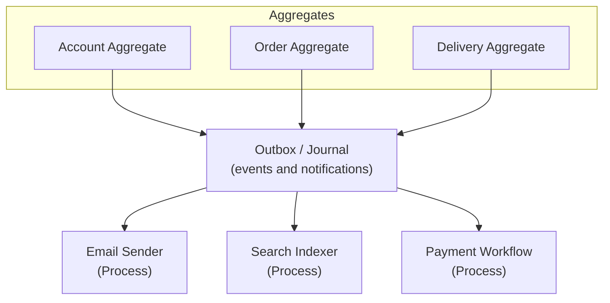
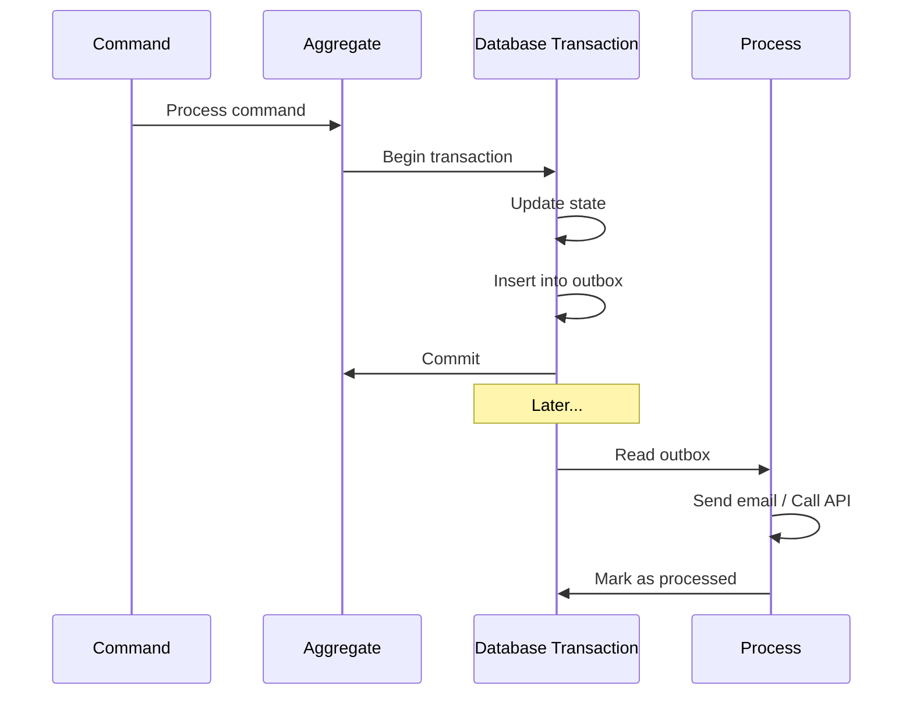
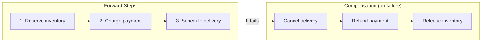

# Processes

## What are Processes?

So far, we've built individual aggregates that respond to commands. But real applications need more:

- **Publishing notifications** to other systems (email, Slack, external APIs)
- **Building read models** (search indexes, reports, dashboards)
- **Orchestrating workflows** across multiple aggregates (order fulfillment, payment processing)

These are all **processes** - background jobs that react to what happens in your system.

> **Real-world analogy**: Think of a restaurant kitchen.
> - **Aggregates** are like individual cooks preparing dishes
> - **Processes** are like the expeditor who coordinates everything: calling out orders, tracking what's ready, notifying servers



## Reading

```scala mdoc:invisible
import cats.implicits.*
import cats.effect.IO
import edomata.backend.*
import edomata.backend.eventsourcing.*
import fs2.Stream
import fs2.Stream.*

// Types from previous chapter
trait Account
trait Event
trait Notification
trait Rejection
```

Having a backend at hand from previous chapters like:
```scala mdoc
def backend : Backend[IO, Account, Event, Rejection, Notification] = ???
```

> **What is a Stream?** In functional programming, a `Stream` is a lazy sequence of values that can be processed one at a time. Unlike a `List` (which loads everything into memory), a stream processes items as they come, making it perfect for:
> - Reading millions of events without running out of memory
> - Continuous processing of incoming notifications
> - Building pipelines that transform data

### Outbox

> **What is the Outbox Pattern?**
>
> Problem: You want to update your database AND send a message (email, event, webhook). If you do both separately, one might fail while the other succeeds, leading to inconsistency.
>
> Solution: Write the message to an "outbox" table in the same transaction as your data change. A separate process reads the outbox and actually sends the messages. If sending fails, it can retry. If it succeeds, it marks the message as processed.



For consuming outboxed items, you can use `backend.outbox` directly, or you can use the provided `OutboxConsumer` like the following:
```scala mdoc
def publisher : Stream[IO, Nothing] = OutboxConsumer(backend){ item =>
  // use outboxed item
  // e.g., send to Kafka, call external API, send email
  ???
}
```

`OutboxConsumer` will consume outboxed items, run the provided action on each of them, marks all items as read.
It does not handle or recover action failures to simplify error handling on application side.

> **Example: Sending notification emails**
> ```scala
> def emailPublisher: Stream[IO, Nothing] = OutboxConsumer(backend) { item =>
>   item.payload match {
>     case Notification.AccountOpened(accountId) =>
>       emailService.send(
>         to = lookupEmail(accountId),
>         subject = "Welcome!",
>         body = "Your account has been opened."
>       )
>     case Notification.BalanceUpdated(accountId, balance) =>
>       emailService.send(
>         to = lookupEmail(accountId),
>         subject = "Balance Updated",
>         body = s"Your new balance is $balance"
>       )
>     case _ => IO.unit
>   }
> }
> ```

> Note that outbox pattern is meant for atomically publishing external messages, and while it has useful data in it, it is not meant to be the medium for processing messages like a queue; and it's best practice to have exactly one consumer on each outbox

### Journal

> **What is the Journal?** The complete, ordered history of all events in your system. Unlike the outbox (which is for notifications to external systems), the journal stores domain events used for event sourcing.

For reading all journal from the beginning you can use:
```scala mdoc
def all = backend.journal.readAll
```

If you are only interested in a single stream, you can use
```scala mdoc
def singleStream = backend.journal.readStream("interesting-stream")
```

> **Streams in event sourcing**: Each aggregate has its own "stream" of events, identified by the aggregate ID. `readStream("account-123")` gives you all events for that specific account.

You can also read before or after a specific sequence number
```scala mdoc
def allAfter = backend.journal.readAllAfter(100)
def singleBefore = backend.journal.readStreamBefore("interesting-stream" ,100)
```

> **Use case: Building a search index**
> ```scala
> def searchIndexer: Stream[IO, Unit] =
>   backend.journal.readAllAfter(lastProcessedSequence).evalMap { event =>
>     for {
>       _ <- updateSearchIndex(event)
>       _ <- saveCheckpoint(event.sequence)
>     } yield ()
>   }
> ```
> This reads all events after a checkpoint, updates a search index, and saves progress. If it crashes, it resumes from the last checkpoint.

### Repository

> **What is the Repository?** A higher-level interface for reading aggregate state. Instead of manually folding events, you get the computed state directly.

You can read the entire history of a single aggregate root
```scala mdoc
def history : Stream[IO, AggregateState[Account, Event, Rejection]] = backend.repository.history("interesting-stream")
```

> **`AggregateState` contains**:
> - The current state of the aggregate
> - The version number (how many events have been applied)
> - Any conflicts (if events couldn't be applied cleanly)

#### Tip
> Note that when you read from repository, you get `AggregateState`, which contains aggregate version on valid streams, or last valid state along with errors and the event that caused this conflict.
> It's worth noting that your journal are never gonna become corrupt by conflicting decisions, as they are prevented before being written to the journal by conflict protection implemented in Edomata; however if you change
> the meaning of events, you can change the meaning of history, and face a conflicting stream history.
> It is one of the most important assumptions of event sourcing, that history won't change its meaning and is not specific to this library, so you should invest in more compatibility testing when you are doing a migration or huge change.

Or read current state of the write side projection
```scala mdoc
def current : IO[AggregateState[Account, Event, Rejection]] = backend.repository.get("interesting-stream")
```


## Integrating

You can easily use provided streams and read functionality to implement any complex processes or business workflows.

### Process Managers

> **What is a Process Manager?** A component that coordinates work across multiple aggregates. It listens to events and sends commands to other aggregates to orchestrate a workflow.

For example, a process manager would be just a possibly stateful stream that handles notifications:

```scala
// Example: Order fulfillment process
def orderFulfillment: Stream[IO, Unit] =
  OutboxConsumer(backend) { item =>
    item.payload match {
      case Notification.OrderPlaced(orderId, items) =>
        for {
          // Reserve inventory
          _ <- inventoryService.reserve(items)
          // Charge payment
          _ <- paymentService.charge(orderId)
          // Schedule delivery
          _ <- deliveryService.schedule(orderId)
        } yield ()

      case Notification.PaymentFailed(orderId) =>
        // Compensate: release inventory
        inventoryService.release(orderId)

      case _ => IO.unit
    }
  }
```

### Sagas

> **What is a Saga?** A pattern for managing long-running business processes that span multiple services. Each step has a compensation action that undoes it if a later step fails.



A new custom read side projection would be just another stream that handles journal events:

```scala
// Example: Build a daily sales report
def salesReportProjection: Stream[IO, Unit] =
  backend.journal.readAllAfter(checkpoint).evalMap { journalEntry =>
    journalEntry.event match {
      case Event.Deposited(amount) =>
        salesReport.recordDeposit(journalEntry.time, amount)
      case Event.Withdrawn(amount) =>
        salesReport.recordWithdrawal(journalEntry.time, amount)
      case _ => IO.unit
    }
  }
```

> **Key insight**: Processes are just streams. This makes them:
> - **Composable**: Combine multiple streams with `.merge`, `.zip`, etc.
> - **Testable**: Feed test data through the stream
> - **Resilient**: Use stream error handling for retries
> - **Observable**: Add metrics and logging as stream stages
